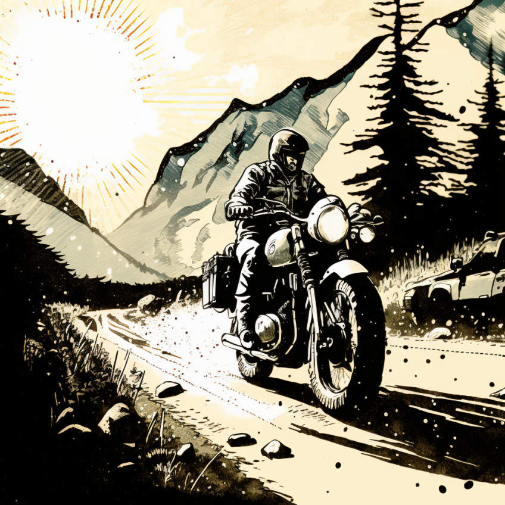

# Hi there! 

My name is **Oleksii Ivashchenko** and I'm a Senior Quality Assurance Engineer! :wave:

My passion is software quality and pushing it to the left.

### :wrench:  Technical Skills:

- **Programming languages**: Javascript/Typescript, Java, Python (in-progress...);
- **Testing tools**: Playwright, Selenium Webdriver (old but gold), Cypress.IO, Postman, Insomnia;
- **Management tools**: Jira, Zephyr, X-Ray, Basecamp;

### :telephone_receiver: Find me also in:

### :headphones: I can talk a lot about

- :motorcycle: Motorcycle solo traveling
- :musical_keyboard: Drumming
- :video_game: Good single-player games

