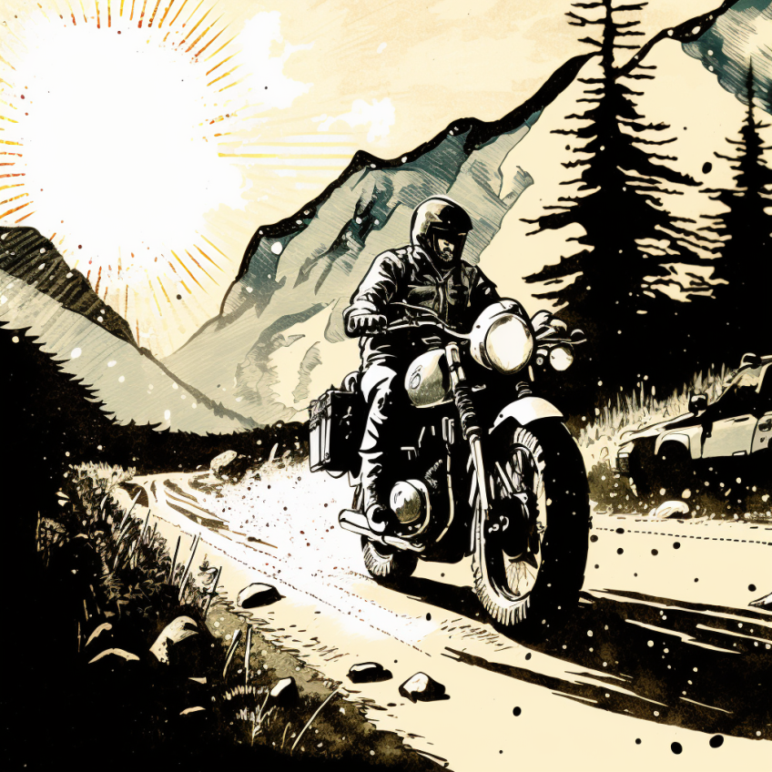

# Hi there! 

My name is **Oleksii Ivashchenko** and I'm a Senior QA Engineer/Team Lead! :wave:

My passion is assuring software quality and shifting it left. As I like to say - "Quality is not an act, it is a habit" and "Software development is a team sport", so I’m driven by a belief that quality is a collective responsibility. By building a shared mindset, I help teams understand that we’re all in the same boat, each accountable for creating a high-quality product. 

In today’s fast-paced world, we need to deliver software in much shorter iterations, making automation essential to maintain speed and consistency. Focusing on quality early will reduces costs and encourages everyone to play an active role in delivering a solid, reliable product from the start.

Feel free to explore and make use of the public repositories here for your own projects or learning. I’m happy to share these resources with the community, believing that knowledge and tools should be accessible to everyone. Whether you’re looking to improve quality practices or explore new ideas, I hope these repositories help you along the way.

### :wrench:  Technical Skills:

- **Programming languages**: Javascript/Typescript (main stack), but also worked with Java, C#, Python (in-progress...);
- **Testing tools**: Playwright, Selenium Webdriver (old but gold), Cypress, Postman, Insomnia;
- **Management tools**: Linear, Testomat, Jira, Zephyr, X-Ray, Basecamp;

### :telephone_receiver: Find me also in:

### :headphones: I can talk a lot about

- :hospital: First aid (I am a certified first responder)
- :motorcycle: Motorcycle solo traveling
- :musical_keyboard: Drumming
- :video_game: Good single-player games

